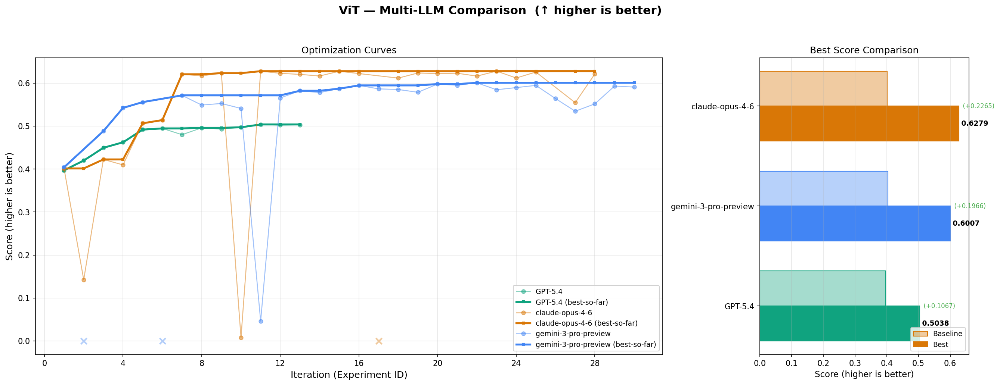
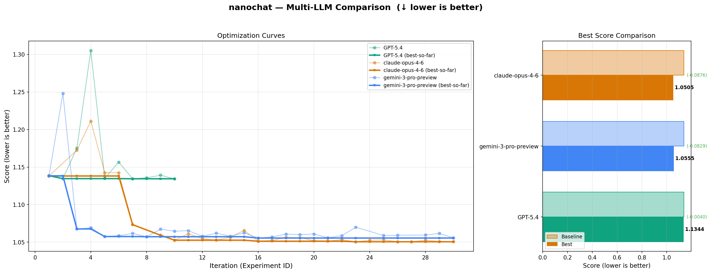

# Benchmarks for AI Autonomous Research Agent

Pure **Agentic Loop** architecture: automatically run baseline → LLM multi-turn tool-call iterative optimization → score-driven code updates.

> [!TIP]
> ***Feel free to share the algorithm you want to run, and I'll help you improve it using Autoresearch Agent***

## Benchmark

We evaluated three frontier LLMs — **GPT-5.4**, **Claude-Opus-4-6**, and **Gemini-3-Pro-Preview** — on two algorithm optimization tasks: ViT image classification and nanochat language modeling. Each LLM was given up to 30 iterations to autonomously improve the baseline code through our Agentic Loop.

### ViT (Image Classification, ↑ higher is better)

Claude-Opus-4-6 achieved the best score of **0.6279**, followed by Gemini-3-Pro-Preview (**0.6007**) and GPT-5.4 (**0.5038**). All three LLMs significantly improved over the baseline (~0.40).



### nanochat (Language Modeling, ↓ lower is better)

Gemini-3-Pro-Preview achieved the best (lowest) score of **1.0555**, closely followed by Claude-Opus-4-6 (**1.0505**). GPT-5.4 reached **1.1344**. All models improved from the baseline (~1.14).




## Architecture

```
run_universal_agent.py          ← CLI entry point
  └─ UniversalAutoResearchAgent.run()
       ├─ _run_baseline()       ← Automatically run original code, initialize score
       └─ Agent Loop (up to N rounds):
            1. Build prompt → call LLM
            2. Parse <tool_call> + <edits>
            3. run_training → apply edits → train → evaluate → score-driven update
            4. Append results to conversation context → back to 1
            5. FINAL_ANSWER → final training → end
```

## Configuration

Copy `.env.example` to `.env` and fill in your API credentials:

```bash
cp .env.example .env
```

Required environment variables:

| Variable | Description |
|----------|-------------|
| `AUTORESEARCH_API_URL` | LLM API endpoint URL |
| `AUTORESEARCH_USERNAME` | API username |
| `AUTORESEARCH_USERID` | API user ID |
| `AUTORESEARCH_TOKEN` | API authentication token |
| `AUTORESEARCH_MODEL_NAME` | *(optional)* LLM model name, default `gemini-3-pro-preview` |

## Quick Start

```bash
# Run nanochat optimization (default 5 tool calls, using default LLM)
python run_universal_agent.py --algorithm nanochat

# Specify LLM model
python run_universal_agent.py --algorithm nanochat --llm gpt-5

# Run ViT optimization, specify LLM and tool call count
python run_universal_agent.py --algorithm ViT --llm gemini-3-pro-preview --max-tool-calls 8

# List available algorithms
python run_universal_agent.py --list
```

Experiment results from different LLMs are automatically isolated into separate directories: `experiments/{algorithm}/{llm_name}/`

## Algorithm Directory Structure

```
algorithms/{name}/
├── train.py        # Training code (required)
├── README.md       # Algorithm description (recommended, injected into LLM prompt)
├── evaluator.py    # Evaluator (optional, uses default evaluator otherwise)
└── prepare.py      # Data preparation (optional)
```

## Experiment Directory Structure

```
experiments/{algorithm}/{llm_name}/
├── experiment_000_baseline/    # Auto-generated baseline
├── experiment_001_xxx/         # 1st optimization
├── experiment_002_xxx/         # 2nd optimization
└── results.json                # All experiment results summary
```

## Visualization

```bash
# Compare all LLMs under one algorithm (default mode)
python visualize_experiment.py --algorithm ViT

# Plot optimization curve for a specific LLM
python visualize_experiment.py --algorithm ViT --llm gemini-3-pro-preview --single

# Plot training curve for a specific experiment
python visualize_experiment.py --algorithm ViT --llm GPT-5.4 --experiment 2

# Specify output path
python visualize_experiment.py --algorithm ViT -o custom_output.png
```

All generated plots are saved to the `visualizations/` directory by default.

## Core Modules

| Module | Responsibility |
|--------|---------------|
| `agent.py` | Main agent, pure Agentic Loop |
| `prompt_builder.py` | Build system/user prompt and tool result feedback |
| `code_editor.py` | Parse `<edit><search>/<replace>` and apply incremental edits |
| `llm_client.py` | LLM API multi-turn conversation client |
| `trainer.py` | Execute training script via subprocess |
| `evaluator.py` | Evaluator base class and default implementation |
| `experiment.py` | Experiment directory management and history |
| `config.py` | API configuration |

## Score-Driven Mechanism

- After each `run_training`, automatically compare score with historical best
- **Score improved** → edits accepted, `current_code` updated
- **Score not improved** → code automatically reverts to last best version
- LLM doesn't need to manage code state, only needs to submit diff edits
